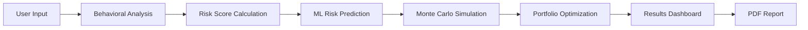

# 🎯 RiskLens AI

<div align="center">

**AI-Powered Investment Risk Profiling & Portfolio Optimization Platform**

[](https://risklens-ai-vert.vercel.app)
[](https://www.python.org/)
[](https://reactjs.org/)
[](https://flask.palletsprojects.com/)
[](LICENSE)

[Live Demo](https://risklens-ai-vert.vercel.app) • [Report Bug](https://github.com/Siddharthgitthub/Risklens-AI/issues) • [Request Feature](https://github.com/Siddharthgitthub/Risklens-AI/issues)

</div>

---

## 📋 Overview

**RiskLens AI** is an intelligent investment advisory platform that combines behavioral finance analysis, machine learning predictions, and Monte Carlo simulations to provide personalized investment recommendations. The system analyzes investor behavior patterns and generates tailored portfolio allocations based on individual risk profiles.

### 🎯 Key Features

- **🧠 Behavioral Analysis**: Psychometric assessment of investor risk tolerance and behavior patterns
- **🤖 Machine Learning Predictions**: Random Forest classifier with 95.8% accuracy for risk profiling
- **📊 Monte Carlo Simulations**: Portfolio performance forecasting using stochastic modeling
- **💼 Smart Portfolio Recommendations**: AI-driven asset allocation across Stocks, Bonds, Gold, and Mutual Funds
- **📈 Real-time Analytics**: Interactive visualizations with Chart.js and dynamic reporting
- **📄 PDF Report Generation**: Comprehensive investment analysis reports
- **🎨 Modern UI/UX**: Built with React, Framer Motion, GSAP, and Tailwind CSS

---

## 🏗️ Architecture

### Technology Stack

#### **Backend (Python/Flask)**
```
risklens-backend/
├── app.py                      # Main Flask API server
├── behavior.py                 # Behavioral finance analysis
├── ml_model.py                 # ML prediction engine
├── montecarlo.py              # Monte Carlo simulation
├── portfolio.py               # Portfolio recommendation logic
├── report.py                  # PDF report generation
├── advanced_train.py          # Model training script
├── final_model.pkl            # Trained Random Forest model
├── advanced_model.pkl         # Decision Tree model
└── requirements.txt           # Python dependencies
```

#### **Frontend (React/Vite)**
```
risklens-frontend/
├── src/                       # React components & pages
├── public/                    # Static assets
├── package.json               # Node dependencies
├── tailwind.config.js         # Tailwind configuration
└── vite.config.js             # Vite build configuration
```

### System Workflow



---

## 🚀 Getting Started

### Prerequisites

- **Python**: 3.8 or higher
- **Node.js**: 16.x or higher
- **npm/yarn**: Latest version

### Installation

#### 1️⃣ Clone the Repository
```bash
git clone https://github.com/Siddharthgitthub/Risklens-AI.git
cd Risklens-AI
```

#### 2️⃣ Backend Setup
```bash
cd risklens-backend

# Create virtual environment
python -m venv venv
source venv/bin/activate  # On Windows: venv\Scripts\activate

# Install dependencies
pip install -r requirements.txt

# Start Flask server
python app.py
```
**Backend will run on**: `http://localhost:5000`

#### 3️⃣ Frontend Setup
```bash
cd risklens-frontend

# Install dependencies
npm install

# Start development server
npm run dev
```
**Frontend will run on**: `http://localhost:5173`

---

## 🔬 Core Components

### 1. Behavioral Analysis (`behavior.py`)

Analyzes user questionnaire responses to determine risk profile:

```python
def analyze_behavior(answers):
    score = sum(answers)
    max_score = len(answers) * 5
    risk_percent = (score / max_score) * 100
    
    if risk_percent < 40:
        profile = "Conservative"
    elif risk_percent < 70:
        profile = "Balanced"
    else:
        profile = "Aggressive"
```

**Investor Profiles:**
- **Conservative** (<40%): Capital Preservation Investor
- **Balanced** (40-70%): Balanced Strategic Investor  
- **Aggressive** (>70%): High Growth Investor

### 2. Machine Learning Model (`ml_model.py`)

Uses a trained Random Forest classifier to predict investor risk category:

```python
model = joblib.load("final_model.pkl")

def predict_risk_real(user_dict):
    df = pd.DataFrame([user_dict])
    df = pd.get_dummies(df)
    prediction = model.predict(df)[0]
    confidence = round(max(model.predict_proba(df)[0]) * 100, 2)
    return prediction, confidence
```

**Model Performance:**
- Random Forest: **95.8% accuracy**
- Decision Tree: **94.4% accuracy**
- Logistic Regression: **94.8% accuracy**

**Key Features:**
- Age, Income, Experience
- Savings, Debt, Dependents
- Risk Tolerance, Investment Discipline
- Financial Knowledge

### 3. Monte Carlo Simulation (`montecarlo.py`)

Runs 200 simulations over 252 trading days to forecast portfolio outcomes:

```python
def run_simulation():
    initial = 100000
    days = 252
    simulations = 200
    
    for _ in range(simulations):
        for _ in range(days):
            change = np.random.normal(0.0008, 0.02)
            prices.append(prices[-1] * (1 + change))
    
    return {"median", "best", "worst"}
```

### 4. Portfolio Recommendations (`portfolio.py`)

Asset allocation strategies based on risk profile:

| Profile | Stocks | Bonds | Gold | Mutual Funds |
|---------|--------|-------|------|--------------|
| **Conservative** | 20% | 50% | 20% | 10% |
| **Balanced** | 40% | 30% | 20% | 10% |
| **Aggressive** | 70% | 10% | 10% | 10% |

---

## 📡 API Endpoints

### `POST /analyze`
**Description**: Main analysis endpoint that processes user data and returns complete risk profile.

**Request Body:**
```json
{
  "age": 30,
  "income": 50000,
  "experience": 5,
  "answers": [3, 4, 2, 5, 3]
}
```

**Response:**
```json
{
  "profile": "Balanced",
  "persona": "Balanced Strategic Investor",
  "score": 17,
  "risk_percent": 68.0,
  "investor_type": "Moderate",
  "confidence": 87.5,
  "accuracy": 95.8,
  "simulation": {
    "median": 120000,
    "best": 180000,
    "worst": 80000
  },
  "portfolio": {
    "Stocks": 40,
    "Bonds": 30,
    "Gold": 20,
    "MutualFunds": 10
  }
}
```

### `POST /download-report`
**Description**: Generates and downloads a PDF investment report.

---

## 🎨 Frontend Technologies

- **React 19.2**: Modern component-based architecture
- **Vite**: Lightning-fast build tool
- **Tailwind CSS**: Utility-first styling
- **Framer Motion**: Smooth animations
- **GSAP**: Advanced animation library
- **Chart.js**: Interactive data visualizations
- **React Router**: Client-side routing
- **Axios**: HTTP client for API calls
- **Three.js**: 3D graphics (optional enhancements)

---

## 🧪 Model Training

To retrain the machine learning model with new data:

```bash
cd risklens-backend

# Train advanced Decision Tree model
python advanced_train.py

# Train real risk prediction model
python train_real_model.py

# Compare model performances
python compare_models.py
```

**Outputs:**
- `final_model.pkl`: Production-ready model
- `feature_importance.csv`: Feature ranking analysis
- Model accuracy metrics and confusion matrix

---

## 📊 Data Sources

- **investor_data.csv**: Training dataset (2.1 MB)
- **investor_real.csv**: Real investor profiles (86 KB)
- **nifty_data.csv**: Market index data (5.7 MB)
- **indexes_df.csv**: Financial index information
- **stocks_df.csv**: Auto-downloaded stock data

---

## 🔒 Security & Privacy

- User data is processed locally
- No sensitive information stored permanently
- CORS enabled for frontend-backend communication
- User history logged anonymously in `user_history.csv`

---

## 🛠️ Development Scripts

### Backend
```bash
python app.py              # Start development server
gunicorn app:app          # Production server
```

### Frontend
```bash
npm run dev               # Development server
npm run build            # Production build
npm run preview          # Preview production build
npm run lint             # Run ESLint
```

---

## 📈 Future Enhancements

- [ ] Real-time market data integration
- [ ] Multi-currency support
- [ ] Advanced risk metrics (VaR, Sharpe Ratio)
- [ ] Social trading features
- [ ] Mobile application (React Native)
- [ ] Multi-language support
- [ ] Enhanced data visualization dashboards
- [ ] Automated rebalancing alerts

---

## 🤝 Contributing

Contributions are welcome! Please follow these steps:

1. Fork the repository
2. Create a feature branch (`git checkout -b feature/AmazingFeature`)
3. Commit your changes (`git commit -m 'Add AmazingFeature'`)
4. Push to the branch (`git push origin feature/AmazingFeature`)
5. Open a Pull Request

---

## 👤 Author

**Siddharth Singh**
- GitHub: [@Siddharthgitthub](https://github.com/Siddharthgitthub)

---

## 🙏 Acknowledgments

- Machine learning powered by scikit-learn
- Financial simulations using NumPy
- UI components built with React ecosystem
- Deployment on Vercel platform

---

## 📞 Support

For issues, questions, or suggestions:
- Open an [issue](https://github.com/Siddharthgitthub/Risklens-AI/issues)
- Visit the [live demo](https://risklens-ai-vert.vercel.app)

---

<div align="center">

**⭐ Star this repository if you find it helpful!**

Made with ❤️ by the RiskLens AI Team

</div>

